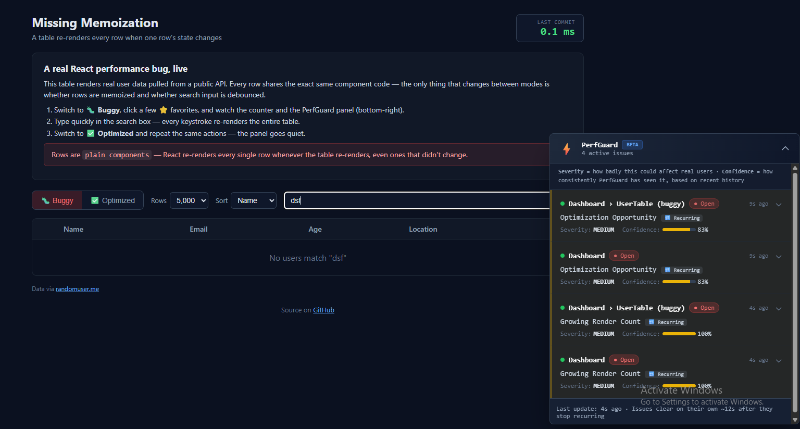
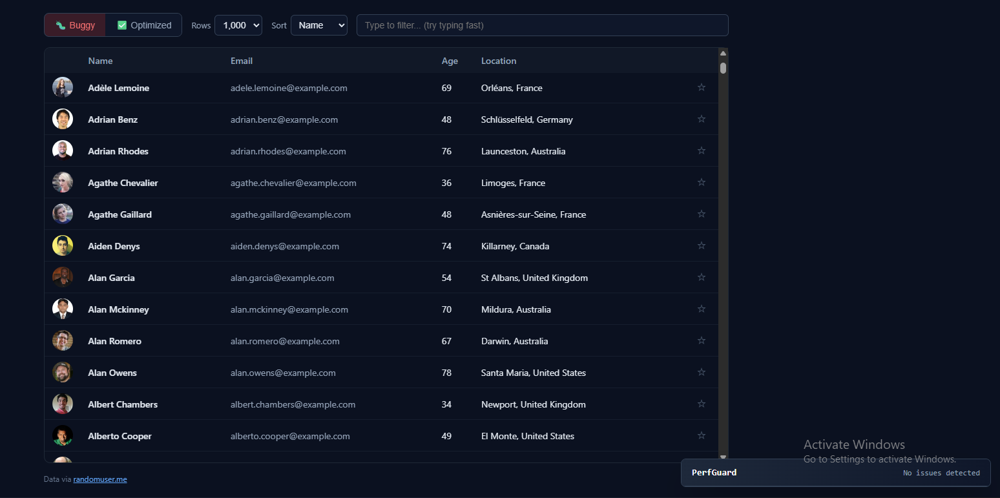

# react-perf-guard

Development-time performance monitoring for React applications. It watches component
render behavior while you work, runs it through a rule engine, and tells you which
components are actually slowing your app down — with enough context to know whether
it is worth fixing.

It is disabled by default in production builds and adds no runtime cost when it is off.

[](https://www.npmjs.com/package/react-perf-guard)
[](https://opensource.org/licenses/MIT)



## Contents

- [Why this exists](#why-this-exists)
- [Installation](#installation)
- [Quick start](#quick-start)
- [How it works](#how-it-works)
- [Reading the panel](#reading-the-panel)
- [Rule reference](#rule-reference)
- [Which issues need action](#which-issues-need-action)
- [Confirmation and auto-resolution](#confirmation-and-auto-resolution)
- [Component paths and nested boundaries](#component-paths-and-nested-boundaries)
- [Boundary types](#boundary-types)
- [Running it against a production build](#running-it-against-a-production-build)
- [API reference](#api-reference)
- [Framework integration](#framework-integration)
- [Examples](#examples)
- [Frequently asked questions](#frequently-asked-questions)
- [Contributing](#contributing)
- [License](#license)

## Why this exists

React's own Profiler API and DevTools give you raw numbers, but they require you to
manually start a recording, interpret the flame graph, and remember to do this
regularly. Most regressions get introduced quietly during normal feature work and are
only noticed once a user complains.

react-perf-guard runs continuously while you develop. It wraps React's Profiler,
batches what it observes, and evaluates it against a set of declarative rules that
know the difference between "this component is occasionally a little slow" and "this
component just regressed by 2x compared to five minutes ago." Matches are deduplicated,
tracked over time, and surfaced in a small panel with a plain-language explanation and
a suggested fix — not a raw millisecond count you have to interpret yourself.

## Installation

```bash
npm install react-perf-guard
```

```bash
pnpm add react-perf-guard
```

```bash
yarn add react-perf-guard
```

Requirements: React 17 or later (Profiler API), and a development environment. The
package has no dependencies beyond React itself.

## Quick start

Wrap your application once, at the root:

```tsx
import { PerfProvider } from "react-perf-guard";

export function App() {
  return (
    <PerfProvider>
      <YourApp />
    </PerfProvider>
  );
}
```

This starts the analyzer (which runs in a Web Worker, off the main thread), loads the
rule set, and mounts the panel. In a production build (`NODE_ENV=production`) this is
a no-op: `PerfProvider` renders `children` and nothing else.

Instrumenting individual components is optional. Do it for components you actually
care about — route-level pages, layout shells, anything on a hot path — not for every
component in the tree.

### Option A: wrap a subtree with `PerfProfiler`

```tsx
import { PerfProfiler } from "react-perf-guard";

export function ProductPage() {
  return (
    <PerfProfiler id="ProductList" boundaryType="PAGE">
      <ProductList />
    </PerfProfiler>
  );
}
```

### Option B: wrap a component with `withPerfGuard`

```tsx
import { withPerfGuard } from "react-perf-guard";

function HeavyComponent() {
  return <div>Heavy UI rendering logic</div>;
}

export default withPerfGuard(HeavyComponent, { boundaryType: "LAYOUT" });
```

Both use React's built-in Profiler internally, so the boundary you define is exactly
the boundary you get instrumented — nothing else in the tree is touched.

## How it works

```
React Profiler (onRender)
        |
        v
Metrics Collector          batches renders per component in memory
        |
        v
Batch flush (every 5s)     sends accumulated snapshots to the worker
        |
        v
Analyzer Web Worker         evaluates snapshots against the rule set, off the main thread
        |
        v
Confirmation gate            requires a rule to recur across 2 separate evaluation
        |                    cycles before it is treated as a real issue
        v
Issue store                  deduplicated, per-component-per-rule state
        |
        v
Panel + console + critical alert overlay
```

Each stage exists to solve a specific noise problem:

- **The collector batches renders per component** so a component that re-rendered 40
  times in five seconds produces one summarized snapshot (render count, average time,
  peak time, mount/update split), not 40 individual log lines.
- **The worker runs off the main thread** so evaluating rules against render history
  never itself causes jank.
- **The confirmation gate exists because a single slow render is not evidence of a
  bug.** Loading a large dataset for the first time is genuinely slow and there may be
  nothing wrong with your code — it just has to render a lot of DOM once. An issue
  only becomes visible once it has recurred across two separate five-second evaluation
  windows. A one-off spike never appears at all.
- **The issue store deduplicates by component and rule, not by severity or
  confidence,** so a single ongoing problem stays as one row that updates in place,
  rather than spawning a new row every time its confidence shifts.

## Reading the panel

Each row in the panel represents one rule that has fired for one component boundary,
and carries:

| Field | Meaning |
|---|---|
| Component path | Where in the tree this happened — see [Component paths](#component-paths-and-nested-boundaries) |
| Status | `Open` while it keeps recurring, `Resolved` once it stops (see [below](#confirmation-and-auto-resolution)) |
| Rule name | Which rule matched, in plain language |
| Severity | `CRITICAL`, `HIGH`, `MEDIUM`, `LOW`, or `INFO` — see the [rule reference](#rule-reference) |
| Confidence | What fraction of recent renders matched the rule's condition |
| Nature badge | `One-time load` or `Recurring` — see [below](#which-issues-need-action) |
| Last seen | How long ago this was last confirmed |

Expanding a row shows a plain-language explanation, a suggested fix, the raw metrics
(render count, average/max time, mount vs. update split), and the underlying rule ID
for anyone who wants to look at the rule definition directly.

## Rule reference

Every rule reports a **base severity**. It can be softened depending on boundary type
and confidence (see [Boundary types](#boundary-types)) — `CRITICAL` is never
downgraded, everything else can be.

| Rule ID | Category | Base severity | Fires when | What it usually means |
|---|---|---|---|---|
| `BLOCKING_RENDER` | Performance | CRITICAL | Average render time > 100ms | The component blocks the main thread long enough to be felt as a freeze |
| `SEVERE_PERF_REGRESSION` | Performance | CRITICAL | Average render time at least doubled vs. the previous measurement | Something recently made this component twice as slow |
| `SUSPICIOUS_RENDER_LOOP` | Reliability | CRITICAL | More than 100 renders in one window | Very likely an unguarded state update causing a render loop |
| `VERY_SLOW_RENDER` | Performance | HIGH | Average render time > 50ms | Consistently slow, will be felt during interaction |
| `SLOW_RENDER` | Performance | HIGH | Average render time > 16ms | Missing the 60fps frame budget on a regular basis |
| `RENDER_THRASHING` | Performance | HIGH | More than 50 renders in one window | Rendering far more often than the UI could possibly need |
| `PERF_REGRESSION` | Performance | HIGH | Average render time increased by 30% or more vs. the previous measurement | A recent change made this component measurably slower |
| `MAX_TIME_REGRESSION` | Stability | HIGH | Peak render time increased by 50% or more | The worst-case render got noticeably worse |
| `POOR_INTERACTION_RESPONSE` | UX | HIGH | Average render time > 50ms | Users will feel a lag when interacting with this component |
| `INCONSISTENT_PERFORMANCE` | Stability | MEDIUM | Peak render time > 50ms | Usually fine, but occasionally spikes |
| `EXCESSIVE_RENDERS` | Performance | MEDIUM | More than 20 renders in one window | Re-rendering more than the interaction pattern justifies |
| `RENDER_COUNT_SPIKE` | Stability | MEDIUM | Render count increased by 50% or more vs. the previous measurement | A new interaction pattern or a missing debounce |
| `JANKY_ANIMATION` | UX | MEDIUM | Average render time > 16.67ms | Can't reliably hit 60fps |
| `RENDER_TIME_CREEP` | Memory | MEDIUM | Average render time trending upward over several measurements | Gradual slowdown — possibly a growing dataset or accumulating state |
| `RENDER_COUNT_CREEP` | Memory | MEDIUM | Render count trending upward over several measurements | State that keeps growing and triggering more frequent updates |
| `ERRATIC_PERFORMANCE` | Stability | MEDIUM | Peak render time > 100ms | Rare but expensive code paths |
| `FIRST_RENDER_SLOW` | UX | MEDIUM | Peak render time on first mount > 200ms | Slow initial mount — a virtualization or pagination candidate |
| `PROD_READY_PERF` | Performance | INFO | Average render time < 10ms | Not a problem — confirms this component is in good shape |
| `DEV_HINT_MEMOIZATION` | Performance | INFO | More than 15 renders in one window | Worth considering `React.memo` if this is on a hot path |
| `DEV_HINT_OPTIMIZATION` | Performance | INFO | Average render time > 20ms | Not urgent, but worth a look if this component is visible often |

## Which issues need action

Severity alone is not enough context — treat severity together with the nature badge:

| | Nature badge: Recurring | Nature badge: One-time load |
|---|---|---|
| **CRITICAL / HIGH** | Fix now. This is a real, repeating problem, usually solved with `React.memo`, a stable callback, or a debounce. | Only worth fixing if it happens on every visit and hurts perceived load time. `React.memo` will not help — the fix is virtualization (windowing) or pagination. |
| **MEDIUM** | Worth investigating soon. | Usually fine to leave as-is. |
| **LOW / INFO** | Optional. `DEV_HINT_*` and `PROD_READY_PERF` are suggestions, not problems. | Ignore. |

The nature badge is derived from the render's mount/update split, which is already
part of the metrics react-perf-guard collects. A component that only ever appears
during `mount` cannot be fixed with memoization — memoization prevents unnecessary
*re-renders*, it does nothing for the first render. A component that keeps appearing
during `update` almost always is a memoization problem.

## Confirmation and auto-resolution

An issue has to recur across at least two separate five-second evaluation cycles
before it is shown at all. This is what makes the panel resistant to one-off spikes —
a single expensive mount, one slow render caused by a debounce firing — instead of
alarming you about something that happened once and never again.

The one rule exempt from this is `SUSPICIOUS_RENDER_LOOP`: a render loop is
unambiguous evidence of a bug even the first time it is observed, so it is not held
back waiting for a second confirmation.

Once an issue is confirmed and visible, it stays `Open` as long as it keeps
recurring. If it stops recurring for about 12 seconds, it is marked `Resolved` and
then removed from the panel a few seconds after that. You do not need to dismiss
issues manually — if it is gone, it stopped happening.

## Component paths and nested boundaries

`PerfProfiler` and `withPerfGuard` boundaries can be nested. Each boundary reports its
own ancestry, so the panel can show, for example, `Dashboard > ProductGrid` rather
than a bare `ProductGrid`.

```tsx
<PerfProfiler id="Dashboard" boundaryType="LAYOUT">
  <PerfProfiler id="ProductGrid" boundaryType="PAGE">
    <ProductGrid />
  </PerfProfiler>
</PerfProfiler>
```

Two things worth knowing about how this behaves in practice:

- React's Profiler fires for **every** ancestor boundary wrapping a commit, not just
  the innermost one. A re-render inside `ProductGrid` produces two measurements: one
  for `ProductGrid` itself, and one for `Dashboard`, whose duration includes
  `ProductGrid`'s cost plus anything else inside `Dashboard`. If you see both flagged
  for the same interaction, that is expected — it tells you the cost is coming from
  that specific branch of the tree.
- Granularity is bounded by where you put boundaries. Wrapping a whole list in one
  boundary gives you one aggregate measurement for the entire list; you cannot tell
  which row was slow. Wrapping every row individually gives per-row precision at the
  cost of a Profiler boundary per row, which is not worth it for large lists. Put
  boundaries at meaningful seams — pages, layout regions, list containers, widgets —
  not on every leaf.
- If two boundaries share the same `id` at different positions in the tree, their
  metrics currently merge into a single bucket. Give each boundary a distinct id, the
  same requirement React's own Profiler already has.

## Boundary types

`boundaryType` tells the rule engine what kind of component this is, and adjusts how
harshly a slow render is treated. The same 50ms render might be fine for a full page,
concerning for a layout shell, and a real problem for an inline element like a button.

| Boundary type | Typical use | Severity effect |
|---|---|---|
| `INLINE` | Small, frequently-rendered elements — buttons, icons, labels | Softened by one severity level (HIGH becomes MEDIUM, MEDIUM becomes LOW, and so on) |
| `HOC` | Default; components wrapped without a more specific type | Standard severity |
| `PAGE` | Route or page-level components | Standard severity |
| `LAYOUT` | Navigation, sidebars, shells, dashboards | Standard severity |
| `PROVIDER` | Context providers and other wrapping infrastructure | Standard severity |

`CRITICAL` severity is never softened by boundary type, regardless of which one you
use.

## Running it against a production build

react-perf-guard is inert by default whenever `NODE_ENV=production`. This is
deliberate — you do not want monitoring overhead, a worker thread, or a floating
panel in a real production deployment.

There is one legitimate exception: showing the tool itself somewhere that only has a
production build available, such as a staging environment or a public demo deployed
to a platform like Vercel. For that case, `PerfProvider` accepts an explicit opt-in:

```tsx
<PerfProvider forceEnable>
  <App />
</PerfProvider>
```

`forceEnable` does exactly what it says — it runs PerfGuard even though the build is
a production build. Do not use it in a real application; it exists specifically for
demo and staging scenarios where you want the tool visible on purpose. The default
(`forceEnable` omitted, or `false`) preserves the normal, safe behavior.

## API reference

### `PerfProvider`

```tsx
<PerfProvider forceEnable={false}>{children}</PerfProvider>
```

| Prop | Type | Default | Description |
|---|---|---|---|
| `children` | `ReactNode` | — | Your application |
| `forceEnable` | `boolean` | `false` | Run even when `NODE_ENV=production`. See [above](#running-it-against-a-production-build). |

### `PerfProfiler`

```tsx
<PerfProfiler id="ComponentName" boundaryType="HOC">{children}</PerfProfiler>
```

| Prop | Type | Default | Description |
|---|---|---|---|
| `id` | `string` | — | Identifies this boundary. Must be unique across the tree. |
| `boundaryType` | `"INLINE" \| "HOC" \| "PAGE" \| "LAYOUT" \| "PROVIDER"` | `"INLINE"` | Adjusts severity sensitivity. See [Boundary types](#boundary-types). |
| `children` | `ReactNode` | — | The subtree to monitor |

### `withPerfGuard`

```tsx
const Guarded = withPerfGuard(Component, options);
```

| Option | Type | Default | Description |
|---|---|---|---|
| `boundaryType` | `BoundaryType` | `"INLINE"` | Same as `PerfProfiler` |
| `enabled` | `boolean` | `true` | Set to `false` to skip instrumenting this component without removing the wrapper |

In a production build, `withPerfGuard` returns the original component unchanged —
there is no wrapper, no Profiler, and nothing left in the bundle to tree-shake around.
This is a stronger guarantee than `PerfProfiler`'s, and is why `withPerfGuard` does
not support `forceEnable`: honoring it would mean always creating the wrapper, which
would give up that guarantee for every consumer, not just the ones opting in.

## Framework integration

### Next.js, Pages Router

```tsx
// _app.tsx
import type { AppProps } from "next/app";
import { PerfProvider } from "react-perf-guard";

export default function MyApp({ Component, pageProps }: AppProps) {
  return (
    <PerfProvider>
      <Component {...pageProps} />
    </PerfProvider>
  );
}
```

### Next.js, App Router

```tsx
// app/providers.tsx
"use client";

import { PerfProvider } from "react-perf-guard";
import { ReactNode } from "react";

export function Providers({ children }: { children: ReactNode }) {
  return <PerfProvider>{children}</PerfProvider>;
}
```

```tsx
// app/layout.tsx
import { Providers } from "./providers";

export default function RootLayout({ children }: { children: React.ReactNode }) {
  return (
    <html lang="en">
      <body>
        <Providers>{children}</Providers>
      </body>
    </html>
  );
}
```

### Vite / Create React App / Remix

Wrap the root render call — `src/main.tsx` for Vite, `src/index.tsx` for CRA,
`app/root.tsx` for Remix — the same way as the quick start example above.

## Examples

The repository includes a full runnable demo at
[`examples/perf-guard-demo`](../../examples/perf-guard-demo), covering four real
scenarios against live public APIs, each with a working/buggy toggle where relevant:

- **Missing memoization** — a large, real-data table where clicking one row's
  favorite button re-renders every row, until `React.memo` is applied.
- **Nested dashboard** — three independent widgets under one dashboard boundary,
  where a bug in exactly one widget is pinpointed by component path while its
  siblings stay quiet.
- **Infinite scroll** — a paginated feed where render cost grows with total items
  shown unless cards are memoized, exercising the trend-based rules.
- **Heavy form** — a validated form where typing in one field re-renders every other
  field until the fields are memoized.

Run it locally:

```bash
git clone https://github.com/amiyaDev/react-perf-guard.git
cd react-perf-guard
pnpm install
pnpm --filter perf-guard-demo dev
```

### Sample output

The same demo, Optimized mode, after the same interactions — nothing recurring, panel
quiet:



What a real, confirmed issue looks like once expanded in the panel:

```
Dashboard > UserTable (buggy)                              Open · 4s ago
Poor Interaction Response                                  Recurring

  Severity: HIGH        Confidence: 100%

  Responding to user interaction (clicks, typing) is taking over 50ms —
  users will feel a lag.

  This is the classic "clicking one item re-renders everything" bug —
  check for missing React.memo and unstable callback props.

  Recurring: seen on repeated re-renders after mount, not just initial
  load — a strong sign of a missing React.memo, an unstable
  callback/prop, or an unnecessary state update.

  1 renders · avg 93.2ms · max 93.2ms · 0 mount / 1 update
  Rule ID: POOR_INTERACTION_RESPONSE · Boundary: PAGE · Last seen: 4s ago
```

## Frequently asked questions

**Why don't I see any issues?** Nothing has recurred across two evaluation cycles
yet — see [Confirmation and auto-resolution](#confirmation-and-auto-resolution). Try
the interaction again a few seconds after the first attempt.

**An issue appeared and then disappeared a few seconds later. Was that a real bug?**
It was real in the sense that it did happen and got confirmed, but it stopped
recurring, so it resolved on its own. Check the nature badge: `One-time load` usually
means it was an unavoidable first-render cost, not something memoization would fix.

**Does this affect my production bundle size?** No. `withPerfGuard` returns your
original component unmodified in a production build. `PerfProvider` and
`PerfProfiler` render their children directly, with no worker, no Profiler, and no
panel. See [Running it against a production build](#running-it-against-a-production-build)
for the one explicit exception.

**Can I customize the rule thresholds?** Not yet through a public API. This is on
the roadmap; today the rule set in `perf-engine/rules.ts` is fixed.

**Does it work with React Native?** No — it depends on the DOM (for the panel and the
critical-alert overlay) and on `Worker`, which are both web APIs.

## Roadmap

- Custom rule authoring API
- CI integration for automated performance checks in pull requests
- Performance budgets per component
- Exportable reports
- Inline ignore annotations for intentional exceptions

## Contributing

Issues and pull requests are welcome. Please include a minimal reproduction for bug
reports — given how much of this tool's behavior depends on timing and render
patterns, a runnable example is far more useful than a description.

## License

MIT (c) Amiya Das
